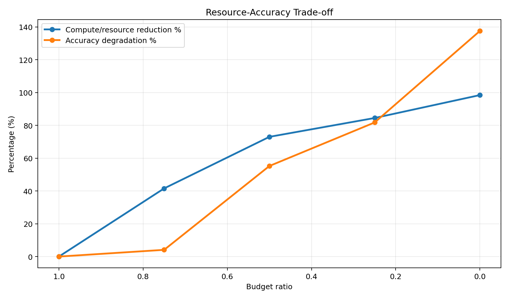

# Nestor Delta

**A multivariate relationship analysis engine — it judges which signals actually drive a target, tracks how those relationships drift over time, and adapts what it keeps under resource pressure. Every step is backed by reproducible experiments.**

Nestor Delta is the data-layer module of the Nestor project. It is a portfolio-grade engineering project, not a commercial product and not an attempt to invent new algorithms. Its value is in *how the pieces are combined, verified, and reasoned about* — including honestly finding and fixing a flaw in an early design.

---

## The Problem

Many real decisions depend on moving signals — business KPIs, market indicators, operational metrics. The hard part is not seeing that numbers changed. The hard part is knowing **which relationships are real, which are drifting, and which signals are just noise that should be ignored.**

Nestor Delta focuses on exactly that data-layer question, and does it under two constraints most toy projects skip: **the relationships change over time**, and **compute is limited**.

---

## The Story Behind It (the part that matters most)

This project's most important result is not a single number — it's a chain of reasoning:

1. **I wanted relationship "weights" to influence prediction.** The natural first idea: scale each signal by its relationship strength, then predict.

2. **I discovered that design was self-deceiving.** The weights had *no effect at all* — because the downstream regression (OLS) freely re-estimates its coefficients and silently cancels any constant scaling. I proved it with a controlled experiment: weighted vs. unweighted inputs gave identical predictions to ten decimal places. The apparent improvement was coming from *signal selection* (dropping noise), not from the weighting.

3. **I redesigned it so the weights are truly operative.** Instead of scaling *after* the model, I moved trust *before* it — as an irreversible gate. Strong signals pass fully, weak-but-useful signals pass partially, noise is blocked. Because the gated signals are combined before the regression, the model can no longer undo them. A counterfactual experiment confirmed it: changing a signal's trust now changes the prediction, whereas in the old design it changed nothing.

4. **I made it track change.** A causal sliding window lets the relationship weights update over time and follow a known, injected drift — verified to use only past data (no leakage).

5. **I made it economize.** Under rising resource pressure, the ignore threshold lifts automatically, keeping fewer, stronger relationships and cutting downstream work — with the accuracy cost measured honestly.

The engineering is real, but the story is the point: **finding a flaw in my own design, understanding the mechanism, and correcting it — with evidence at every step.**

---

## Key Results

<!-- ▼▼▼ 图片位置 1：漂移追踪曲线（横轴 time step，三条线：true coefficient / dynamic weight estimate / static weight）▼▼▼ -->

<!-- ▲▲▲ 说明：数据来自 reports/dynamic_weight_trajectory.csv ▲▲▲ -->

*As the true influence of a driver rises over time, the dynamic weight estimate rises to follow it, while the static weight stays flat. The dynamic relationship weight moved in the correct drift direction across all 5 frozen seeds.*

<!-- ▼▼▼ 图片位置 2：权衡曲线（横轴 budget_ratio，两条线：resource/compute reduction % 与 accuracy degradation %）▼▼▼ -->

<!-- ▲▲▲ 说明：数据来自 S5 权衡报告 CSV ▲▲▲ -->

*As resource pressure rises, the ignore threshold lifts, downstream work drops sharply, and accuracy degrades only modestly — a controllable, auditable trade-off.*

**Headline numbers (all measured on frozen synthetic data, five fixed seeds, test split only):**

| Stage | What it does | Result |
|---|---|---|
| Baselines | persistence / simple OLS | MAE 0.566 / 0.428 |
| Weighted prediction | selects true drivers, drops noise | MAE **0.422** (beats both baselines) |
| Trust gating | makes weights numerically operative | counterfactual: prediction Δ **0.077** (gated) vs **0.000** (old design) |
| Dynamic drift | tracks a known changing relationship | MAE **0.506** vs static 0.548 — **7.5% lower** on drift data; 5/5 seeds track correctly |
| Resource-adaptive ignore | trades compute for accuracy | monotonic downstream reduction with measured, modest accuracy loss |

---

## How It Works — a Ladder of Capabilities

Each capability is an independent, testable module built on the one before it, without modifying any earlier frozen code (open/closed principle):

- **Relationship weighting** — lagged correlation estimates how strongly one signal relates to another, with direction preserved. Layer-independent and reusable.
- **Weighted three-variable prediction** — selects the strongest true drivers, excludes noise, and predicts one step ahead.
- **Trust gating** — an irreversible pre-model filter that makes the relationship weights actually influence the prediction (see the story above).
- **Dynamic drift tracking** — a causal sliding window that lets the weights adapt as relationships change over time, using only past observations.
- **Resource-adaptive ignore** — a single `budget_ratio` control lifts the ignore threshold under pressure, pruning weak relationships to save downstream computation.

---

## Verification & Reproducibility (a core design goal, not an afterthought)

This project treats "can you trust these numbers?" as a first-class requirement:

- **Deterministic, pure standard library** — no third-party runtime dependencies; every run is byte-for-byte reproducible from a clean checkout.
- **Leakage prevention is enforced and tested** — features never use future rows; the causal window was verified by corrupting all future data and confirming past estimates were unchanged.
- **Ground-truth validation** — because the synthetic data has a *known* generating structure and a *known* drift path, the engine's estimates can be checked against the real answer, not just against a baseline.
- **Every claim is backed by a committed report and an automated test.**

```bash
# reproduce the full pipeline from a clean checkout
python3 -m venv .venv && source .venv/bin/activate
python -m pip install -r requirements-lock.txt
python scripts/run_baselines.py
python scripts/run_weights.py
python scripts/run_stage1.py
python scripts/run_trust_gating.py
python scripts/run_dynamic_weights.py
python -m unittest discover -s tests
```

---

## Architecture & Discipline

The project is governed by three documents so that direction, progress, and workflow never drift:

- **`BLUEPRINT.md`** — the constitution: goals, scope, and hard boundaries.
- **`HANDOFF.md`** — current progress, next focus, and pending decisions.
- **`RUNBOOK.md`** — how the (human + AI) collaboration operates.

Design principles held throughout: **modular and low-coupling; open for extension, closed for modification** (each new capability adds files, never edits frozen ones); **a fixed, frozen evaluation protocol** so every "improvement %" is measured against the same ruler.

---

## Honest Scope

- Nestor Delta uses **established methods**; it does not claim a new algorithm. Its contribution is disciplined engineering integration and rigorous, reproducible verification.
- It is validated on **controlled synthetic data** where the ground truth is known — the right setting to prove a mechanism is correct. Public real-world data is a later credibility layer, not part of the core mechanism validation.
- The engine is deliberately narrow (the data layer). Event-impact analysis and cross-layer reasoning belong to other Nestor modules.

---

## Project Structure

```
src/nestor_delta/     # capability modules (weighting, gating, dynamic, ignore, ...)
scripts/              # one-command entry points that produce the reports
reports/              # committed, reproducible result artifacts
tests/                # determinism, correctness, and leakage-prevention tests
docs/                 # per-capability design notes
EVALUATION.md         # the frozen evaluation protocol
BLUEPRINT.md / HANDOFF.md / RUNBOOK.md   # project governance
```
