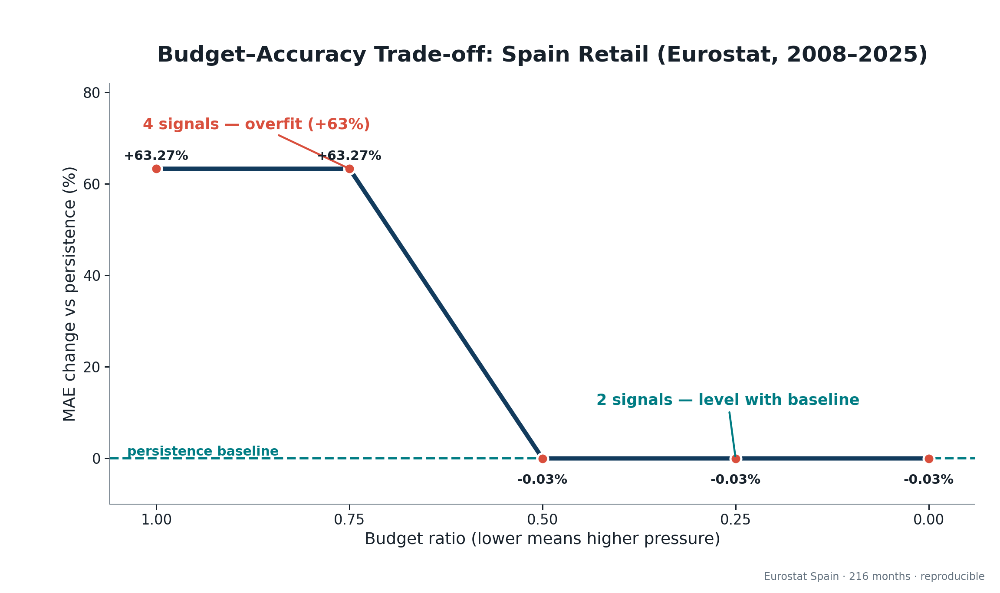
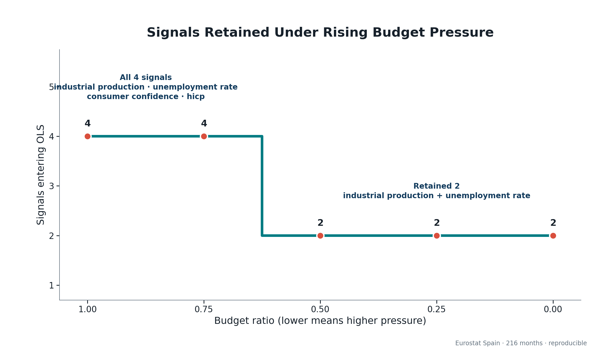
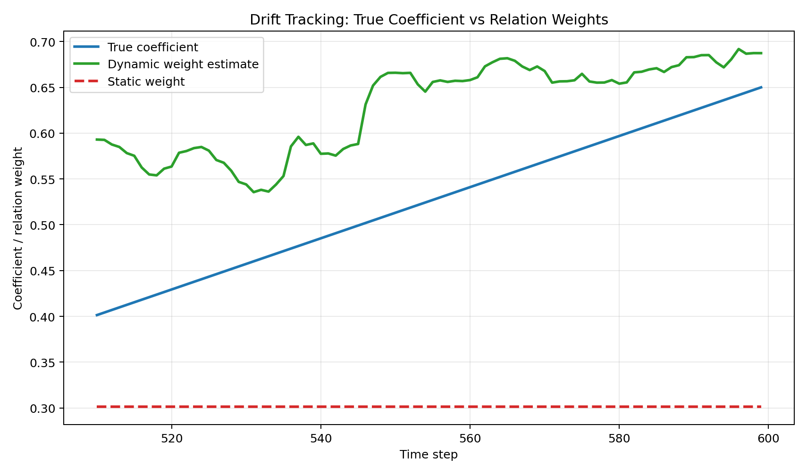

# Nestor Delta

**A deterministic multivariate relationship analysis engine that ranks lagged co-movement, tracks drift with past-only windows, filters weak signals under budget pressure, and checks whether the remaining signals improve out-of-sample prediction.**

Nestor Delta is the data-layer module of the Nestor project. It combines established statistical methods with strict evaluation discipline: fixed data splits, train-only decisions, deterministic reports, leakage tests, and explicit comparison with simple baselines.

It reports **co-movement and predictive usefulness, not causation**.

---

## What It Answers

When many measurements move at once, Nestor Delta asks four narrow questions:

1. Which candidate signals move with the target, at which lag, and in which direction?
2. Does that relationship change over time?
3. Which weak or redundant signals should be excluded before prediction?
4. On held-out data, does the resulting model do better than a simple baseline?

The last question matters. A relationship can look convincing in training data and still fail when the future arrives.

---

## Real-World Result: Spain Retail

The first real case uses **216 monthly Eurostat observations from Spain (2008-2025)**. The target is retail sales volume; the four candidate columns are industrial production, unemployment, a column originally labeled consumer confidence, and the Harmonised Index of Consumer Prices (HICP). A later audit established that the mislabeled column actually contains construction confidence (`BS-CCI-BAL`); the frozen data and metrics remain unchanged, and the correction is recorded in the case [erratum](cases/spain_retail_eurostat_2008_2025/ERRATA.md).

The fixed split trains through `2023-12` and evaluates once on the 24 months from `2024-01` through `2025-12`. An external case builder aligned the exact monthly axis with no missing rows, interpolation, or imputation. Eurostat marked the retail and industrial source snapshots as provisional.



*With all four signals, test MAE was 63.27% worse than persistence. At the three higher-pressure tiers, the model retained two signals and finished at -0.03% versus persistence: effectively level, not a win.*

What happened:

- The `1.00` and `0.75` budget tiers admitted all four signals and overfit badly out of sample.
- At `0.50`, `0.25`, and `0.00`, the higher threshold excluded the mislabeled construction-confidence column and HICP while retaining industrial production and unemployment.
- The two excluded signals showed train-period co-movement that did not hold up in the test period.
- All five tiers were fixed before evaluation and all five are reported. No tier was selected after looking at test performance.



*The fixed threshold scan reduced the prediction input from four signals to two. In this case, filtering acted as an overfitting guard: it moved the model from a large out-of-sample penalty back to approximate parity with persistence.*

This result is worth showing precisely because it does **not** beat the baseline. The mechanism removed signals that failed to generalize, but it did not manufacture a predictive victory. The case demonstrates controlled behavior on messy real data and a willingness to report a tie as a tie.

See the committed [metrics](reports/spain_retail_eurostat_2008_2025/real_budget_sweep_metrics.csv), [predictions](reports/spain_retail_eurostat_2008_2025/real_budget_sweep_predictions.csv), and [interpretation boundary](reports/spain_retail_eurostat_2008_2025/real_budget_sweep_summary.md).

---

## Key Findings

The dual-window evaluation separated ordinary-period behavior from a structural-break test using 15 availability-gated signals across nine Eurostat datasets. In Case A, validation showed no improvement over persistence, so the baseline guard correctly froze the system as baseline-only and produced no fabricated Delta metric. In Case B, a five-signal model improved on persistence by 7.11% in validation but became 9.63% worse during the 2020-2021 pandemic window, showing that resource-aware filtering is not online shock detection. See the one-page [Dual-Window Findings](reports/DUAL_WINDOW_FINDINGS.md) for the protocol, results, and next technical boundary.

---

## The Design Correction That Shaped the Project

The most important engineering result is a flaw that was found, explained, and corrected.

1. **Initial idea:** scale each input by its relationship strength, then fit an ordinary least-squares model.
2. **Failure found:** independent constant scaling had no effect on prediction. OLS simply re-estimated its coefficients and cancelled the scaling. Weighted and unweighted predictions were identical to ten decimal places.
3. **Mechanism identified:** the apparent gain came from signal selection - dropping noise - rather than from the weights themselves.
4. **Redesign:** move trust before the model as an irreversible gate. Strong signals pass fully, intermediate signals pass proportionally, and weak signals are blocked. The admitted sources are combined before OLS, so their relative admissions cannot be independently reconstructed.
5. **Counterfactual check:** changing one signal's trust produced a mean absolute prediction change of `0.0774200737` in the gated model, versus `0.0000000000` in the old independently scaled design.

This correction is the project's central story: do not trust a mechanism because its name sounds plausible; isolate whether it changes behavior, explain why, and preserve the evidence.

---

## Controlled Mechanism Validation

Synthetic fixtures provide known signal roles and a known injected drift path. That makes them the right place to test whether each mechanism behaves as intended before using it on real data.



*Across all five frozen seeds, the dynamic relation estimate moved in the injected positive drift direction while the static estimate stayed fixed. The coefficient and relation weight are different quantities, so the claim is directional tracking, not coefficient equality.*

All headline results below use frozen synthetic data and fixed test splits:

| Capability | Frozen result | What it establishes |
|---|---|---|
| Baselines | persistence MAE `0.566021`; simple OLS MAE `0.428163` | fixed comparison ruler |
| Selected three-variable model | MAE `0.422277`, 1.37% below simple OLS | a modest gain from selecting known useful signals and dropping noise, not from feature scaling |
| Trust gate | prediction delta `0.0774200737` gated vs `0.0000000000` old design | trust is numerically operative after the redesign |
| Dynamic drift | MAE `0.506484` vs static `0.547689` (7.52% lower); 5/5 seeds move correctly | past-only adaptation follows the injected drift direction |
| Resource-adaptive ignore | at budget `0.75`, downstream proxies fall 41.56% with 4.11% MAE loss | moderate pressure can remove weak relationships at a measured quality cost |
| Extreme resource pressure | at budget `0.00`, downstream proxies fall 98.46% while MAE loss reaches 137.57% | the trade-off is bounded and reported, not presented as free compression |

The resource figures are **downstream compute and memory proxies after relation discovery**. Every candidate relation is still scored upstream, so these results do not claim end-to-end compute reduction. See the complete [five-tier resource report](reports/resource_adaptive_summary.md).

---

## Capability Ladder

Each capability is an independent, testable addition. Earlier frozen modules and reports remain unchanged as later capabilities are added.

- **Relationship scoring** - estimates lagged Pearson co-movement, preserving direction and selecting a deterministic lag.
- **Selected prediction** - keeps the strongest candidate signals, excludes synthetic noise, and predicts one step ahead.
- **Trust gating** - makes trust operative through an irreversible pre-model gate and shared admitted signal.
- **Dynamic drift tracking** - recomputes relation estimates through a 120-row past-only rolling window.
- **Resource-adaptive ignore** - raises a deterministic threshold as `budget_ratio` falls, retaining fewer relationships.
- **Real-data runner** - validates an author-prepared CSV and config, then emits rankings, predictions, metrics, and a bounded summary.
- **Budget sweep connector** - applies the five frozen pressure tiers to the real-data prediction path, freezes every model on train data, and evaluates all tiers once on test data.

---

## Verification and Reproducibility

The core engine uses the Python standard library only. Optional presentation chart generation uses Matplotlib and is outside the core runtime dependency lock.

The repository verifies:

- **Past-only decisions:** relation scoring, lag selection, filtering, collinearity handling, and fitting use train data only.
- **Adversarial leakage checks:** corrupting future or test rows leaves past estimates, selected signals, and fitted coefficients unchanged.
- **Column-order independence:** physically reordering candidate columns does not change decisions or reports.
- **Deterministic collinearity backoff:** exact and approximate collinearity degrade to a stable lower-ranked signal set instead of crashing or producing NaNs.
- **Strict real-data input:** missing dates, uneven intervals, invalid values, or malformed configuration fail explicitly; the runner does not guess, fill, or clean.
- **Byte-level report reproduction:** frozen CSV and Markdown artifacts regenerate identically under the locked protocol.

Every numerical claim in this README points to a committed report and an automated test.

### Reproduce the core pipeline

```bash
python3 -m venv .venv
source .venv/bin/activate
python -m pip install -r requirements-lock.txt

python scripts/run_baselines.py
python scripts/run_weights.py
python scripts/run_stage1.py
python scripts/run_trust_gating.py
python scripts/run_dynamic_weights.py
python scripts/run_resource_adaptive_ignore.py
python -m unittest discover -s tests
```

### Reproduce the Spain budget sweep

```bash
python scripts/run_real_budget_sweep.py \
  cases/spain_retail_eurostat_2008_2025/case.json
```

The real-data runner does not fetch APIs or clean raw data. It analyzes a local CSV that has already been aligned by an external case builder. It reports co-movement and out-of-sample predictive usefulness only.

The presentation PNGs are committed. Regenerating the two Spain charts additionally requires Matplotlib:

```bash
python scripts/plot_spain_case.py
```

---

## Architecture and Discipline

Three governance documents keep scope, state, and workflow explicit:

- [`BLUEPRINT.md`](BLUEPRINT.md) - goals, architecture, scope, and hard boundaries.
- [`HANDOFF.md`](HANDOFF.md) - current status, next focus, and pending decisions.
- [`RUNBOOK.md`](RUNBOOK.md) - the human-plus-AI collaboration protocol.

The implementation follows an open/closed discipline: new capabilities are added as independent modules rather than by rewriting frozen behavior. [`EVALUATION.md`](EVALUATION.md) provides the fixed ruler used for synthetic comparisons.

---

## Honest Scope

- Nestor Delta combines established methods; it does not claim a novel algorithm.
- Synthetic fixtures validate mechanism behavior because their signal roles and drift path are known.
- The Eurostat case tests the same discipline on real data, including an outcome that only matches a naive baseline.
- Resource results describe downstream proxies, not measured end-to-end runtime.
- Results describe co-movement and out-of-sample predictive usefulness, never causation.
- Data ingestion, API fetching, automatic cleaning, dashboards, and end-user uploads are outside the current scope.
- Event-impact analysis and cross-layer reasoning belong to other Nestor modules.

---

## Project Structure

```text
src/nestor_delta/     capability modules: scoring, gating, drift, ignore, real data
scripts/              deterministic entry points and optional chart generation
cases/                author-prepared real-data CSV and configuration
reports/              committed result artifacts and presentation charts
tests/                correctness, determinism, leakage, and stability tests
docs/                 per-capability design notes
EVALUATION.md         frozen synthetic evaluation protocol
BLUEPRINT.md          architecture and scope
HANDOFF.md            current project state
RUNBOOK.md            collaboration workflow
```
